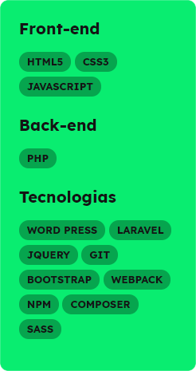

## Boas-vindas ao meu perfil 👋

Meu nome é Anderson Silva, tenho 19 anos e sou estudante de programação. Estudo a mais de 4 anos Desenvolvimento Web e Web Design.
A linguagem base que trabalho hoje em dia é o PHP. Estudei diversos bancos de dados, como o MongoDB, MariaDB e me especializei no MySQL.

### Gosto de trabalhar em equipe e valorizo todas visões, aceitando opiniões divergentes no meio profissional.

### Como me encontrar?
- 📫 E-mail para trabalhos ou parcerias: andersonfer.web@gmail.com
- 💬 [Me envie uma mensagem no WhatsApp](https://api.whatsapp.com/send?phone=77999301495&text=Gostei%20do%20seu%20trabalho,%20Anderson.%20Me%20conte%20mais%20sobre.)
- 🌐 [Visite meu portfólio](https://andersonweb.github.io/portfolio/)

<!--
**andersonweb/andersonweb** is a ✨ _special_ ✨ repository because its `README.md` (this file) appears on your GitHub profile.

Here are some ideas to get you started:

- 🔭 I’m currently working on ...
- 🌱 I’m currently learning ...
- 👯 I’m looking to collaborate on ...
- 🤔 I’m looking for help with ...
- 💬 Ask me about ...
- 📫 How to reach me: ...
- 😄 Pronouns: ...
- ⚡ Fun fact: ...
-->
